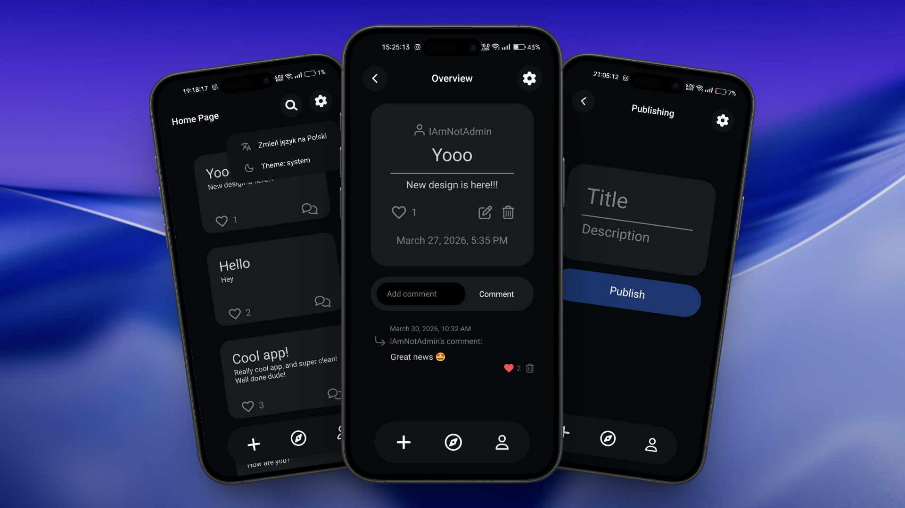

  

# React Native Expo + Express App

This is a full‑stack mobile application built with **React Native (Expo)** on the frontend and **Node.js (Express)** on the backend where people can communicate with each other. The project includes user authentication, posts, profiles, likes, comments, and basic admin functionality. 

## 🚀 Features

**Accounts Management:** login, registration, jwtkey-based session validation, email-based recovery.
**Post System:** Create, edit, delete, and view posts.
**Interactions:** Like/unlike posts. _(SOON: Commenting functionality.)_
**Admin Tools:** Functionality to block/unblock users and delete posts.

## 📚 Libs

### Frontend

* React Native 
* Expo Router (file‑based routing)
* TypeScript
* Expo vector-icons

### Backend

* Node.js
* Express.js
* MySQL
* JWT Authentication
* Nodemailer (password recovery emails)

## 📺 Demo

If you want to try out this project go to [releases](https://github.com/BartoszDuczmal/mobile-app/releases) and check out the latest demo version. You must have an android device.

## 📄 License

### MIT License

Copyright (c) 2026 Bartosz Duczmal
